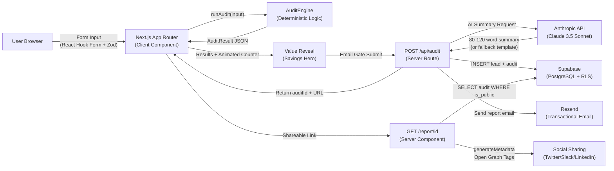

# ARCHITECTURE.md — System Architecture & Technical Trade-offs

## System Diagram

## Data Flow Summary

1. **Client-Side:** User fills the form → data validated by Zod → persisted in localStorage via useLocalStorage hook → submitted to runAudit() which runs entirely in the browser.
2. **Email Gate:** User submits email → POST /api/audit fires → server generates AI summary (with fallback), writes to Supabase, and triggers Resend email — all in parallel.
3. **Viral Loop:** Shareable /report/[id] page fetches the public audit from Supabase using the anon key (RLS ensures only is_public=true rows are readable). generateMetadata() dynamically builds Open Graph tags.

---

## 5 Technical Trade-offs

### 1. Hardcoded Pricing vs. Dynamic Scraping
**Chose:** Hardcoded pricing data in pricing-data.ts.
**Why:** Scraping vendor pricing pages introduces latency, fragility (DOM changes break scrapers), and non-determinism. For an MVP where trust = credibility, we need 100% reproducible and auditable calculations. The pricing file is versioned in Git and documented in PRICING_DATA.md with sources.
**Cost:** Manual updates required when vendors change pricing (~quarterly).

### 2. Client-Side Audit Calculation vs. Server-Side
**Chose:** runAudit() runs entirely in the browser.
**Why:** Zero latency on the "Aha!" moment. The user clicks "Audit My Stack" and sees savings instantly — no loading spinner, no API call. Critical for conversion.
**Cost:** Audit logic is visible in client-side JavaScript. Acceptable because the moat is Credex's buyer network, not the rule engine.

### 3. Anthropic API with Fallback vs. Pure AI-Generated
**Chose:** AI summary with mandatory try/catch fallback to template-based summaries.
**Why:** API failures (rate limits, timeouts, missing keys) must never block the user flow. The fallback generates a finance-literate summary using the savings tier and top-saving tool.
**Cost:** Fallback summaries are less personalized than Claude-generated ones.

### 4. Supabase (Managed PostgreSQL) vs. Self-Hosted
**Chose:** Supabase with Row Level Security (RLS).
**Why:** Instant setup, built-in RLS for public/private data access, generous free tier (50K rows). Managing PostgreSQL infrastructure would be premature optimization for an MVP.
**Cost:** Vendor lock-in on the Supabase SDK. Migration to raw PostgreSQL is straightforward since we use standard SQL.

### 5. Email Gate Before Details vs. Fully Open
**Chose:** Show total savings openly, blur per-tool details behind email gate.
**Why:** The "Aha!" moment must be friction-free to maximize engagement. Gating the detailed breakdown creates urgency while ensuring we capture the lead.
**Cost:** Some users bounce at the gate. Mitigation: value is already proven by the time they reach it.

---

## Scaling to 10,000 Audits/Day

### Current Architecture Limits
- **AuditEngine:** Runs client-side — scales infinitely with zero server cost.
- **Supabase:** Free tier handles ~500 concurrent connections. At 10K audits/day (~7/min), well within limits.
- **Anthropic API:** Rate-limited. At 10K/day, we'd hit Claude's default rate limits.

### Scaling Strategy

1. **Redis Caching for AI Summaries:** Hash the AuditResult JSON and cache the Anthropic response in Redis (e.g., Upstash). Similar stacks produce similar summaries — cache hit rate of 40-60% cuts API calls in half.
2. **Edge Functions for Routing:** Deploy /api/audit as a Vercel Edge Function for sub-50ms cold starts globally.
3. **Supabase Connection Pooling:** Switch to a connection-pooled Supabase URL (PgBouncer) to handle concurrent writes.
4. **Queue-Based Email Dispatch:** Replace synchronous Resend calls with a job queue (e.g., Inngest or QStash) to decouple email delivery from API response latency.
